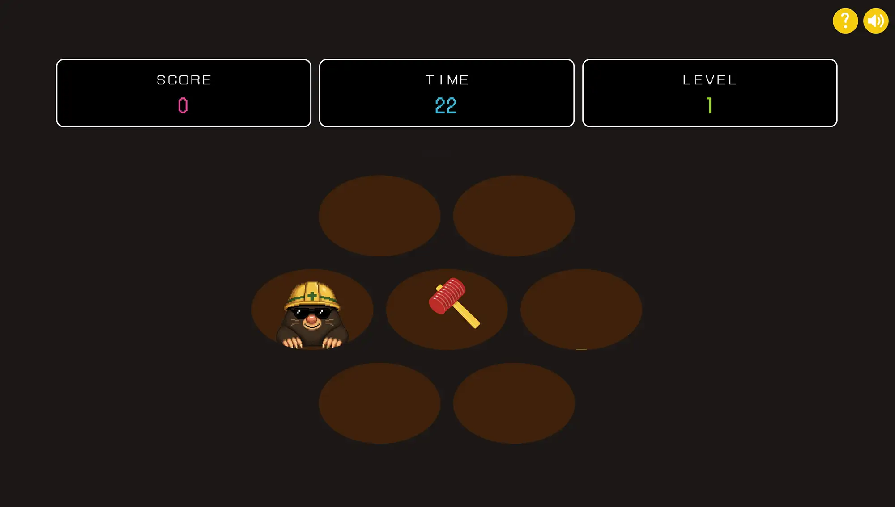

# ①課題名

じゃんけんアプリ リッチver.「モグラたたき」

## ②課題内容（どんな作品か）

- ピコピコハンマーでモグラを叩いて高スコアを目指そう！5点ごとにレベルアップ！

## ③アプリのデプロイURL

https://wild-river.github.io/kadai02_janken_rich/

## ④アプリのログイン用IDまたはPassword（ある場合）

- ID: 今回なし
- PW: 今回なし

## ⑤工夫した点・こだわった点

- Math.random()を使ってゲームができないか、と考えて、モグラ叩きゲームを作りました。
- レトロなゲーム画面のような構成を意識しました。
- BGMは3種類。好きなBGMを選んてプレイできます。
- ゲーム結果はデバイスごとに保存され、右上の「？」ボタンを押すと過去の記録が参照できます。

## ⑥難しかった点・次回トライしたいこと（又は機能）

- モグラが出るタイミング、叩くタイミングで起きるイベントを整理するのが大変でした。
- マウスが「ピコピコハンマー」の動作になるように作り上げることに苦労しました。
- もっとゲームの楽しさ、面白さを感じるような工夫をしたい！（難易度調整、高得点モグラの出現など）

## ⑦フリー項目（感想、シェアしたいこと等なんでも）

楽しんでもらえれば嬉しいです！
